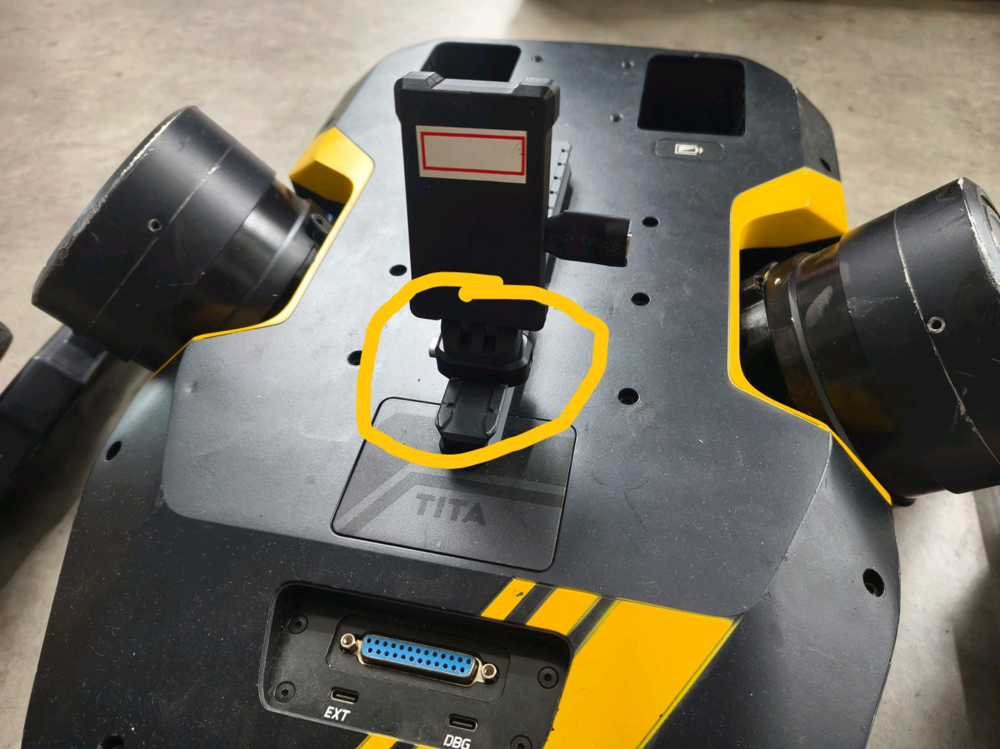
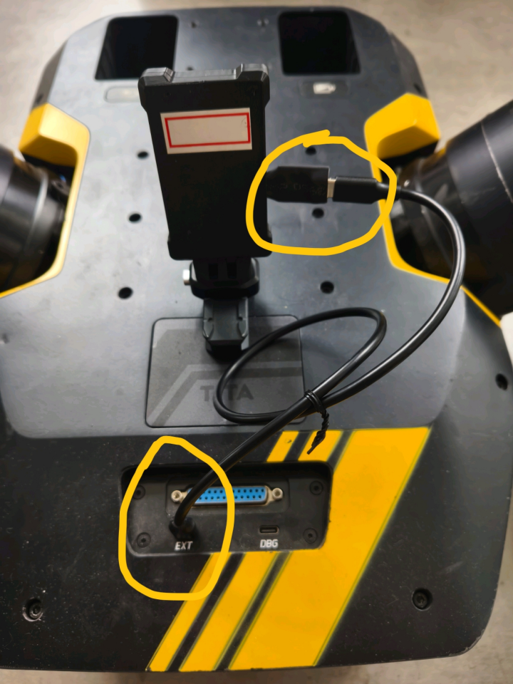
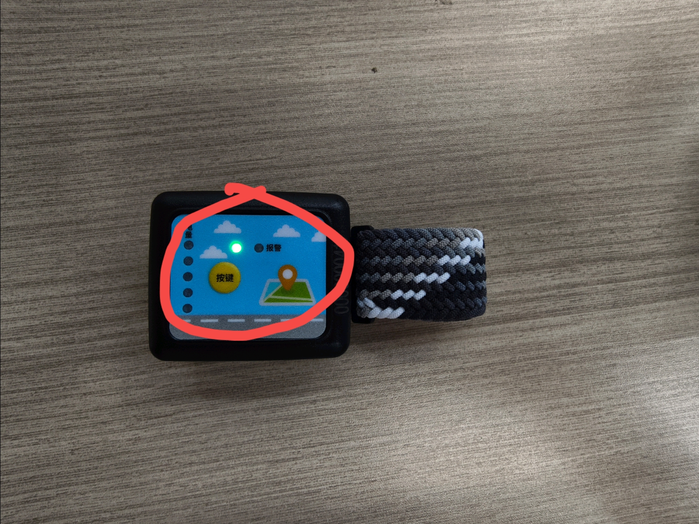

<p align="center"><strong>UWB Follower</strong></p>
<p align="center"><a href="https://github.com/Vulcan-YJX/tita_uwb_follower/blob/dev/LICENSE"></a>


</p>


​	基于串口通信的 `UWB` 机器人跟随方案。通过 UWB 进行目标的定位，通过 TITA 的 use_sdk 模式，控制机器人的运动。本仓库仅开放了生成产物，便于在机器人中进行部署。

## 前期准备

- `TITA` 默认用户是 `robot` , 密码为 `apollo`

- 使用串口线连接 `TITA` 的 `debug` 接口

  - ```bash
    ssh -p 22 robot@192.168.42.1
    ```

- 下载并安装串口库

  - ```bash
    wget https://github.com/Vulcan-YJX/tita_uwb_follower/releases/download/v1.0/serial-1.0.0-Linux.deb
    sudo apt install ./serial-1.0.0-Linux.deb
    ```

- 下载生成产物

  - ```bash
    cd
    wget https://github.com/Vulcan-YJX/tita_uwb_follower/releases/download/v1.0/person_ws.zip
    unzip person_ws.zip
    ```


## 硬件连接

- 将通过模块底部卡扣将设备安装到机器人滑轨上，模块标签页为正面，朝机器人前方。具体安装如下图所示：
  - 

- 将数据线一端接入模块，另一段接入机器人的 `EXT` 口，具体安装如下图所示：
  - 

- 长按手环按键，直至手环绿灯长亮，如下图所示：
  - 

## 启动程序

- ```bash
  git clone https://github.com/Vulcan-YJX/tita_uwb_follower.git
  cd tita_uwb_follower
  chmod +x run.sh
  ./run.sh
  ```


## 模块测试

- 使用遥控器启动 `use_sdk`
- 使用手环靠近机器人前方左右晃动，看机器人是否自动朝向手环，如果能，则安装启动成功。


## 致谢

> [!NOTE]
>
> 感谢项目的原作者 [Li](https://github.com/CixiangLi) 对 TITA 二次开发所做的贡献。

